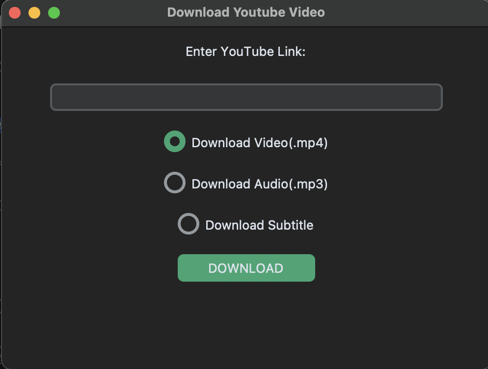
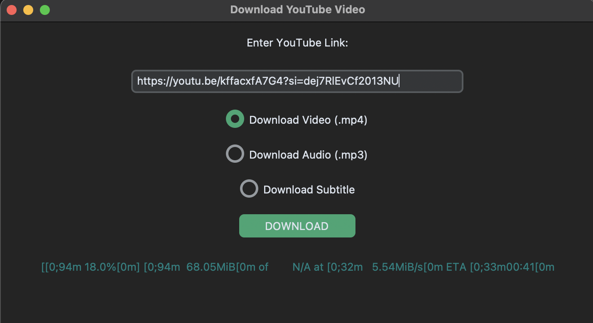
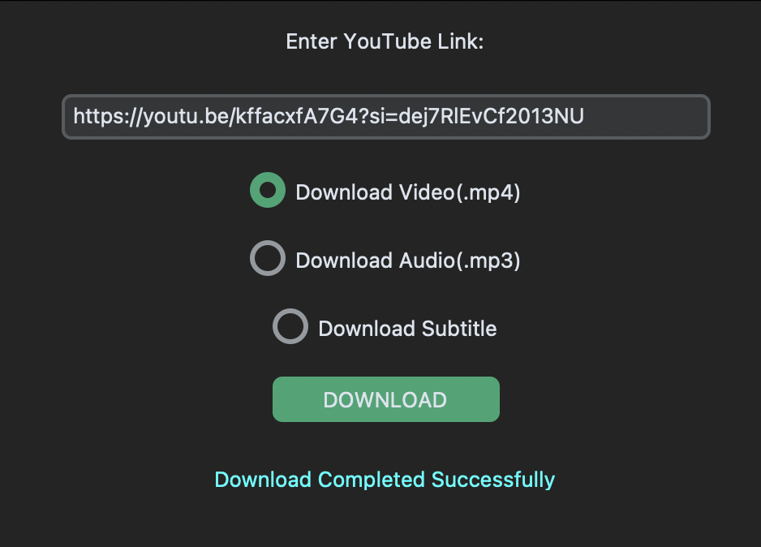
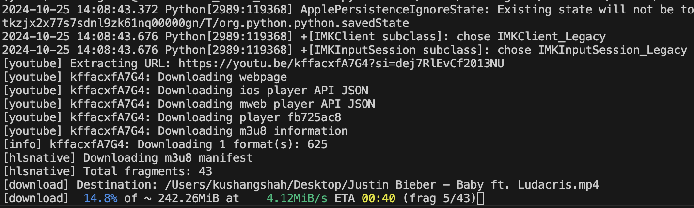

<h1 align='center'>YouTube Video Downloader 🎥</h1>

---

### A simple, stylish YouTube Video Downloader app created with **Python** and **CustomTkinter**. Easily download high-quality video, audio, or subtitles from YouTube with just a few clicks!

---

## 🌟 Features

- **Easy-to-use GUI**: Built with CustomTkinter for a sleek, intuitive interface.
- **Video and Audio Download Options**: Choose to download either video in **MP4/MKV** format or audio in **MP3**.
- **Subtitle Support**: Download available subtitles for a video.
- **Progress Indicator**: Real-time download progress, including percent completed, total file size, and estimated time remaining.

## 📸 Screenshots

<p align="Center">
    1
    
</p>
<p align='center'>
    2
</p>
<p align='center'>
    3
</p>

| Feature           | Description                    |
|-------------------|--------------------------------|
| **1. Main Interface** | A clean input area with download options. |
| **2. Progress Display** | Real-time download status. |
| **3. Success Notification** | Completion message for successful downloads. |
<br>

<details>
    <summary>What's happing at the back?</summary>
    <p align=center> </p>
    <p><h2 align=center>I wouldn't care if I were you.</h2></p>
</details><br>

---

## 🛠 Installation

### 1. **Clone this repository:**
   ```bash
   git clone https://github.com/KushangShah/Youtube_Video_Downloder.git
   cd Youtube_Video_Downloader
   ```

### 2. **Install required libraries** (consider using a virtual environment):
   ```bash
   pip install -r requirements.txt
   ```
## OR
### Directly connect to the virtual envirment provided in this file. Just type in your terminal
```bash
source ytenv/bin/activate
```

### 3. **Run the app:**
   ```bash
   python3 Youtube_Vid_Downloder.py
   ```

## 🖥 Packaging the App for Distribution

If you'd like to share this app as a standalone file, you can package it using **PyInstaller**:

```bash
pyinstaller --onefile --windowed Youtube_Vid_Downloder.py
```
<br>

---

# 📂 Usage

#### 1. **Enter the YouTube/Short/Reel URL** in the provided text field.
#### 2. **Choose the desired format**: Video, Audio, or Subtitle.
#### 3. **Select the output directory**.
#### 4. **Press "Download"** and track progress in real-time!

---

# 📚 Dependencies - --> ignore

#### - `FFmpeg`: Required for handling audio extraction and conversion (download and add to PATH if not installed).

---

# 💡 Future Plans

#### - **Additional format options** (e.g., different resolutions, codecs).
#### - **More languages** for subtitles.
#### - **Enhanced progress tracking** with download speed display.

---

# 🤝 Contributing

Feel free to open issues, submit PRs, or suggest new features! For major changes, please discuss them with the repository maintainers beforehand.

---

# 🔒 License

This project is licensed under the MIT License. See [LICENSE](/LICENSE) for more details.

---

# Connect With me
<p align="center">
    <a href="https://twitter.com/kushang97157764" target="blank"></a>
    <a href="https://linkedin.com/in/kushang-s-388959268/" target="blank"></a>
    <a href="https://instagram.com/bhootiya.renderr/" target="blank"></a>
    <a href="mailto:kushangshah41@gmail.com" target="blank"></a>
</p>

Happy downloading! 🎉
